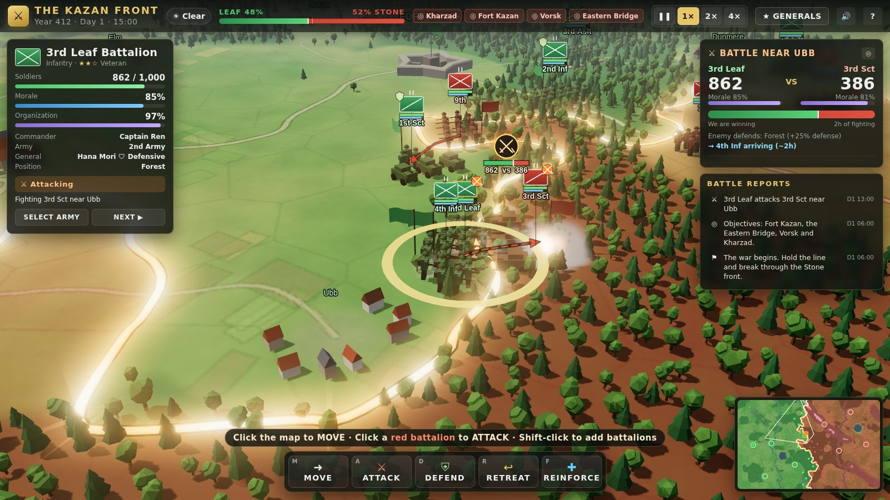

# Battalion Command — The Kazan Front

A 3D browser war strategy game about commanding battalions on a living front line.
Hearts of Iron–style fronts meet a simple real-time strategy game: **see the front → move battalions → attack → watch the battle develop → capture territory → push the enemy back.**



## Play

Open `index.html` in a modern desktop browser (Chrome, Edge, Firefox, Safari). Everything is bundled into `dist/game.js`, so no server is needed.

To work on the code:

```sh
npm install
npm run dev     # rebuilds on change and serves on http://localhost:8080
npm run build   # production bundle -> dist/game.js
```

## How to play (30 seconds)

| | |
|---|---|
| **Select** | Click one of your green battalions (or a row in the left panel). Shift-click or Shift-drag to select several; double-click selects a whole army. |
| **Move** | Click anywhere on the map. The route is drawn as an animated arrow. |
| **Attack** | Click a red enemy battalion. Combat starts automatically when your battalion reaches it. |
| **Defend** | `D` — dig in. Entrenchment builds over a few hours (sandbags appear) and makes the battalion very hard to dislodge. |
| **Retreat** | `R` — fall back to the nearest safe town to recover. |
| **Reinforce** | `F`, then click a friendly battalion or a battle marker. 500 vs 900 becomes 1,200 vs 900. |

Camera: drag to pan, wheel to zoom, `Q`/`E` (or middle-drag) to rotate. `Space` pauses, `1`/`2`/`3` set speed, `B` jumps to the current battle, `G` opens the generals, `H` shows the field manual.

## What's in the war

- **The map** — a 3D continent of ~1,400 territories with mountains (and a pass guarded by Fort Kazan), forests, two rivers with bridges, roads, cities, forts, villages and open fields. Leaf (green) holds the west, the Stone Dominion (red) the east.
- **The front line** — a glowing ribbon along every border between the two sides. It moves as battalions capture ground; freshly taken territory flashes.
- **Battalions** — Infantry, Assault, Scout, Medical and Heavy Weapons battalions, rendered as formations of soldiers, armored cars, guns and field hospitals. Each has soldiers, morale, organization, experience (Green → Elite), a captain and an army.
- **Battles** — they take time. Strength, morale, organization, experience, terrain (forest, mountain, town, fort, river crossing), entrenchment, generals, weather and reinforcements all shift the balance bar. Units break and retreat when morale or organization hit zero; surrounded units can surrender.
- **Generals** — Kakashi (Strategist), Hana Mori (Defensive), Daichi Ono (Aggressive) and Ryo Kenta (Reckless, in reserve). Swap them between armies on the Generals screen.
- **Living battles** — battle reports and floating text: breakthroughs, wavering morale, wounded commanders, reinforcements arriving, positions captured, forced retreats.
- **Strongholds** — capitals, cities, forts and bridgeheads must be held for several hours to fall (a siege ring shows progress). Capturing one rattles nearby defenders.
- **Enemy AI** — holds a continuous line, garrisons its capital, hunts weak battalions, reinforces losing fights, pulls back broken units, counterattacks lost towns and launches breakthrough offensives.
- **Battlefield events** — heavy rain, fog (hides distant enemies), artillery barrages, reinforcements, wounded generals, blown bridges, surprise attacks and morale collapses.
- **Winning** — capture Kharzad, or all four objectives (Kharzad, Fort Kazan, Vorsk, the Eastern Bridge). Take two and the **enemy front collapses**. Lose Sennai, or all of your own objectives, and the war is lost.

Three difficulties: **Recruit**, **Officer** and **General**.

## Code tour

```
src/
  data/config.js      scenario: sides, terrain, unit types, generals, armies, locations, difficulty
  world/mapgen.js     Voronoi territories, heightmap, rivers along borders, roads, bridges
  sim/                game clock, battalions & orders, combat, territory/supply, enemy AI, events
  render/             Three.js scene: terrain + territory tint, water, forests & towns,
                      formations, front-line ribbon, particles, 2D HUD overlay
  ui/                 panels, input, minimap, synthesized sound
  main.js             boot, title screen, main loop
```

The simulation is plain JavaScript with no rendering dependencies, so it also runs headless in Node.
